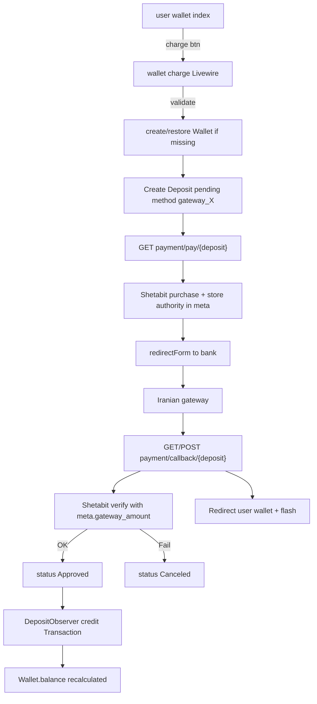

# Plan: User Wallet + Iranian Gateway Charge

## Goal
صفحه **کیف پول کاربر** (فقط مشاهده، بدون ساخت تا اولین تراکنش)، صفحه **شارژ** از طریق درگاه‌های فعال تنظیمات، و جریان کامل **Shetabit purchase → callback verify → Approved** تا موجودی از طریق `DepositObserver` شارژ شود. لینک در سایدبار کاربر.

## Locked decisions
- لیست والت: ارزهای فعال را نشان بده؛ اگر ردیف Wallet نبود موجودی `0` نمایش بده — **بدون create**.
- Wallet فقط هنگام شروع شارژ (اولین Deposit) ساخته/restore شود.
- `locked_balance` در UI کاربر **نمایش داده نشود**.
- شارژ فقط با درایورهای `PaymentGateways::enabledDrivers()`؛ پیش‌فرض از `PaymentSettings->default`.
- بعد از Verify موفق Shetabit → `DepositStatusEnum::Approved` (اعتبار کیف از `DepositObserver`).
- Verify ناموفق / انصراف → `Canceled`.
- مدل Payment جدید ساخته نمی‌شود؛ همه چیز روی `Deposit` با `method = gateway_{driver}`.
- Initiate + callback در `PaymentController`؛ Livewire فقط فرم شارژ و redirect به pay.
- `redirectForm` به فارسی/RTL و submit فوری بهینه‌سازی شود.

## Architecture



## Implementation steps

### 1. Routes
**Update** [`routes/web.php`](routes/web.php):

```php
// inside auth group — User Panel
Route::livewire('/panels/user/wallet', 'pages::panels.user.wallet.index')
    ->name('panels.user.wallet.index');
Route::livewire('/panels/user/wallet/charge', 'pages::panels.user.wallet.charge')
    ->name('panels.user.wallet.charge');
Route::livewire('/panels/user/wallet/{wallet}/transactions', 'pages::panels.user.wallet.transaction.index')
    ->name('panels.user.wallet.transaction.index');

Route::get('/payment/pay/{deposit}', [PaymentController::class, 'pay'])
    ->name('payment.pay');

// outside auth — bank callback (no session auth)
Route::match(['get', 'post'], '/payment/callback/{deposit}', [PaymentController::class, 'callback'])
    ->name('payment.callback');
```

**Update** [`bootstrap/app.php`](bootstrap/app.php): CSRF exception for callback:

```php
$middleware->validateCsrfTokens(except: [
    'payment/callback/*',
]);
```

### 2. PaymentController
**Implement** [`app/Http/Controllers/PaymentController.php`](app/Http/Controllers/PaymentController.php):

| Method | Auth | Behavior |
|--------|------|----------|
| `pay(Deposit $deposit)` | auth | مالک Deposit = user فعلی؛ status باید `pending`؛ درایور از `method`؛ `Payment::via($driver)->callbackUrl(route('payment.callback', $deposit))->purchase(Invoice, save authority)->pay()->render()` |
| `callback(Request, Deposit $deposit)` | public | Idempotent: اگر already `Approved` → redirect موفق؛ اگر `Canceled/Rejected` → fail؛ وگرنه `Payment::via()->amount(meta.gateway_amount)->transactionId(authority)->verify()`؛ OK → Approved + tracking_code=refId؛ Fail → Canceled؛ redirect به wallet با session flash |

جزئیات مهم:
- درایور: `substr($deposit->method, 8)` فقط اگر `str_starts_with(..., 'gateway_')`.
- Authority در `meta['authority']` و/یا `tracking_code` هنگام purchase ذخیره شود.
- `meta['gateway_amount']` (int) و `meta['driver']` برای verify اجباری.
- وضعیت قبل از رفتن به بانک: `Pending`؛ هنگام purchase موفق می‌توان `Processing` گذاشت (اختیاری؛ برای لیست ادمین مفید است). پیشنهاد: بعد از دریافت authority → `Processing`.
- بعد از verify موفق → `Approved` داخل `DB::transaction`.
- خطاها: toast/flash پیام از `__('general.payment_*')`.

### 3. Amount helper (minimal)
**Add** به [`app/Support/PaymentGateways.php`](app/Support/PaymentGateways.php):

```php
public static function toGatewayAmount(string $amount, string $driver): int
public static function driverFromMethod(string $method): ?string
```

منطق `toGatewayAmount`:
- مبلغ کیف پول را به int برای Shetabit تبدیل کند.
- `config("payment.drivers.$driver.currency")`: `'T'` یا `'R'`.
- اگر ارز کیف `IRR`/`ریال` و درایور `T` → تبدیل ریال→تومان.
- اگر ارز `IRT`/`TMN`/`تومان` و درایور `T` → `(int) round(amount)`.
- اگر درایور `R` و مبلغ تومان است → `* 10`.
- حداقل مبلغ درگاه در validation شارژ.

Fallback سادهٔ پیشنهادی برای v1: فقط ارزهای `type = fiat` فعال؛ مبلغ واردشده همان واحد درایور پیش‌فرض (معمولاً تومان)؛ در `meta.gateway_amount` همان int ذخیره‌شود و verify دقیقاً همان را استفاده کند.

### 4. User wallet index
**Implement** [`resources/views/pages/panels/user/wallet/⚡index.blade.php`](resources/views/pages/panels/user/wallet/⚡index.blade.php):

- الگوی نزدیک به ادمین per-user wallet، ولی:
  - `Auth::user()` به‌جای `$user`
  - **بدون** `rowClicked` / `addWallet`
  - **بدون** ستون locked_balance
- Query: `Currency::where(is_active)->with(['wallets' => where user_id])->paginate`
- ستون‌ها: ارز (logo/name/symbol)، موجودی (`$wallet?->balance ?? 0`)، وضعیت فعال بودن wallet در صورت وجود
- دکمه بالای صفحه: Charge → `route('panels.user.wallet.charge')`
- اگر wallet وجود داشت: لینک تراکنش‌ها
- breadcrumbs + title + search
- Flash پرداخت را در `mount` با `Flux::toast` نشان بده

### 5. Charge page
**Implement** [`resources/views/pages/panels/user/wallet/⚡charge.blade.php`](resources/views/pages/panels/user/wallet/⚡charge.blade.php):

فیلدها:
- `currency_id` — select searchable از ارزهای fiat فعال
- `amount` — عدد مثبت
- `driver` — از `PaymentGateways::enabledDrivers()`؛ پیش‌فرض `PaymentSettings->default`

Validation:
```
currency_id: required|exists active fiat currency
amount: required|numeric|min:{min_gateway}
driver: required|in:enabledDrivers
```

`submit()`:
1. Validate
2. DB transaction: find-or-create/restore Wallet
3. Create Deposit pending با `method=gateway_{driver}`
4. `return $this->redirect(route('payment.pay', $deposit), navigate: false)` — بدون wire:navigate چون HTML خام Shetabit است

UI: `flux:card`، breadcrumbs، دکمه Save تمام‌عرض teal.

### 6. User transaction index (stub موجود)
**Implement lightly** [`resources/views/pages/panels/user/wallet/transaction/⚡index.blade.php`](resources/views/pages/panels/user/wallet/transaction/⚡index.blade.php):

- فقط wallet متعلق به auth user
- جدول: type، amount، balance_after، description، created_at + pagination
- بدون locked؛ بدون CRUD

### 7. redirectForm optimize
**Update** [`resources/views/vendor/shetabitPayment/redirectForm.blade.php`](resources/views/vendor/shetabitPayment/redirectForm.blade.php):

- `lang="fa"` + `dir="rtl"`
- متن‌های ترجمه‌شده
- Submit فوری + countdown کوتاه (۳ث) به‌عنوان fallback
- حذف `setTimeout` رشته‌ای

### 8. Sidebar + lang
**Update** [`resources/views/layouts/panels/user.blade.php`](resources/views/layouts/panels/user.blade.php) — آیتم wallet با icon و `routeIs('panels.user.wallet.*')`.

**Update** `lang/fa/general.php` + `lang/en/general.php`:
`charge_wallet`, `charge`, `payment_redirecting`, `payment_success`, `payment_failed`, `payment_canceled`, `select_gateway`, `min_charge_amount`, ...

### 9. Authorization guards
- `payment.pay`: مالک Deposit + method gateway + status pending/processing
- `payment.callback`: public؛ idempotent با `lockForUpdate`
- wallet transactions: مالک wallet

## Critical files

| Path | Action |
|------|--------|
| `routes/web.php` | Add user wallet + payment routes |
| `bootstrap/app.php` | CSRF except callback |
| `app/Http/Controllers/PaymentController.php` | Implement pay + callback |
| `app/Support/PaymentGateways.php` | `toGatewayAmount`, `driverFromMethod` |
| `resources/views/pages/panels/user/wallet/⚡index.blade.php` | Implement list |
| `resources/views/pages/panels/user/wallet/⚡charge.blade.php` | Implement charge form |
| `resources/views/pages/panels/user/wallet/transaction/⚡index.blade.php` | Implement list |
| `resources/views/vendor/shetabitPayment/redirectForm.blade.php` | RTL/FA optimize |
| `resources/views/layouts/panels/user.blade.php` | Sidebar link |
| `lang/fa/general.php`, `lang/en/general.php` | Strings |

## Edge cases
1. Double callback → بدون double-credit
2. Verify fail → Canceled؛ ادمین Payments برای بررسی دستی
3. Soft-deleted wallet → restore هنگام شارژ
4. Gateway disabled mid-flight → خطا در pay
5. User mismatch روی pay → 403
6. Livewire نباید `wire:navigate` به redirectForm بزند

## Out of scope
- ساخت Wallet با کلیک ردیف
- نمایش locked_balance به کاربر
- Withdrawal کاربر
- تغییر DepositObserver / TransactionObserver
- مدل Payment جدا

## Verification
1. بدون wallet → لیست ارزها با موجودی ۰؛ هیچ ردیف DB ساخته نشود
2. Sidebar لینک wallets
3. Charge → Deposit + wallet → redirectForm → بانک
4. Callback OK → Approved + credit + افزایش balance
5. Callback تکراری → بدون double-credit
6. Callback fail → canceled؛ balance ثابت
7. locked در UI کاربر نیست
8. ادمین Payments همان gateway deposits را می‌بیند
9. CSRF روی POST callback خطا نمی‌دهد
